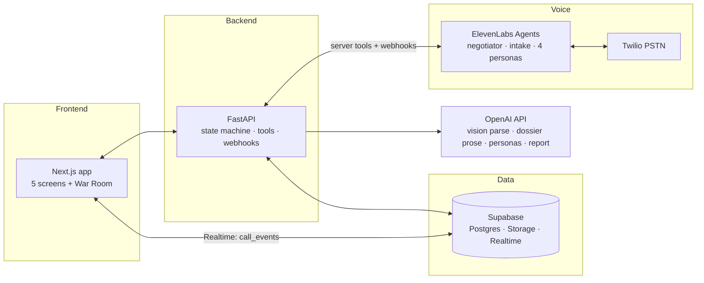

# The Negotiator — Medical Bills · PRD
**Hack-Nation 6th Global AI Hackathon · Challenge 01 (ElevenLabs) · Team: Susy · J · Hamza · Kar Shin**

---

## §0 · TL;DR & How to Read This

**The product in one sentence:** *An AI advocate that reads your hospital bill, finds the errors and the law on your side, calls the billing office, and talks the price down on a live call.*

We build the challenge's three modules — **Estimator → Caller → Closer** — for the medical-bills vertical. The Estimator parses a bill + EOB and runs a voice interview to build one confirmed JobSpec. The Caller places real Twilio phone calls (against our own counterparty agents and one live human role-player). The Closer runs a deterministic negotiation ladder through the voice agent and produces a ranked, transcript-cited evidence report.

**Read your section first, then §4 (scope) and §12 (interfaces):**

| Person | Start here | Then |
|---|---|---|
| **Susy** (UX/frontend) | §11 | §12, §8.2 (ladder rungs the War Room renders), §6, `docs/workplans/susy.md` |
| **J** (data) | §10 | §12, §7, `docs/workplans/j.md` |
| **Hamza** (engine/orchestration/scaffold) | §7–§9 | §6, §12, `docs/workplans/hamza.md` |
| **Kar Shin** (narrative/personas/video) | §14, §9 | §15, §12, §8.4–8.6 (the style layer he applies), `docs/workplans/kar-shin.md` |

Claude Code acts as the build orchestrator across the whole app — integration, wiring, and unblocking runs through Hamza + Claude.

---

## §1 · Product Summary & Vision

Every phone-priced market hides its real prices; medical billing hides them *and* stacks errors, fictional list prices, and unclaimed legal protections on top. Unlike moving quotes (the brief's example vertical), medical-bill leverage is not comparison shopping — it is **asymmetric information plus statute**: the patient who knows the Medicare rate, the hospital's own posted cash price, the coding errors on the bill, and their §501(r)/No Surprises Act rights routinely cuts a bill 30–70% (advocacy-industry range — see §2 flags). Almost nobody knows those things, and nobody has the stamina for the phone calls. Software now does.

**Full vision:** multi-week campaigns per bill (gather → negotiate → confirm calls), insurer appeals, charity-care application filing, collections defense, real hospital calls under HIPAA authorization — a consumer product where the agent's own call outcomes compound into an ever-better benchmark and strategy dataset.

**This 14-hour build:** one continuous end-to-end run of the full loop — real documents in, real (Twilio) calls against simulated-but-reactive counterparties plus one human role-player, a live mid-call price move caused by leverage, and an evidence report out. Everything downstream of the dial tone is production-shaped; only the far end of the line is simulated.

---

## §2 · Problem & Evidence

**Safe-to-cite anchors (hard-codeable in product copy and the deck):**

| Fact | Source |
|---|---|
| Employers/private insurers paid on average **254% of Medicare** for the same services at the same facilities (2022) | RAND Hospital Price Transparency Study, Round 5.1 (2024) |
| Hospital charges average **3.4× Medicare-allowable cost**; top-50 hospitals ~10×, outlier 12.6× | Bai & Anderson, *Health Affairs* 2015 |
| **~20%** of claims denied on average (19% in-network, 37% out-of-network, 2024) | KFF, ACA Marketplace claims analysis |
| Medical collections **under $500 no longer appear on credit reports** (2023); paid collections removed (July 2022); 1-year reporting delay | Equifax/Experian/TransUnion joint changes, 2022–2023 |
| NSA self-pay dispute right: GFE exceeded by **$400+**, file within **120 days**, $25 fee | CMS, No Surprises Act |
| Patients negotiating directly succeeded far more with **providers (63%) than insurers (37%)** | Kyanko & Busch, *AJMC* 2016 *(2011 survey, out-of-network bills — dated, directional)* |

**Success base rates (flag the caveats wherever cited):**
- **61.8%** of patients who negotiated got a price drop; **73.7%** who reported a suspected error got it corrected — Duffy et al., *JAMA Health Forum* 2024. *Flag: subsamples of n=14 and n=37 — directionally encouraging, not precise.*
- **78%** of those who challenged a bill had charges reduced/removed (AKASA/YouGov 2022); **93%** (LendingTree 2021). *Flag: self-reported surveys, selection bias.*
- **38%** of disputers saw balances reduced or eliminated (Commonwealth Fund 2023).

**Advocacy-industry estimates (always attributed + ranged, never stated bare):**
- "**49–80%** of medical bills contain errors" — range spans CFPB-cited conservative figure to Medical Billing Advocates of America's estimate. Product motivation, not established fact.
- "Three levers combined routinely yield **30–70%** reductions; charity care alone **50–100%**; published advocate case studies document **50–86%**" — practitioner/vendor figures.

**The behavioral gap is the product:** 64% of Americans have never challenged a medical bill (AKASA) — yet most who do, win. Initiation and persistence, not tactic sophistication, are the binding constraints. An agent has infinite persistence.

---

## §3 · Users & Demo Persona

**Primary user:** an insured patient holding an unaffordable or suspicious hospital balance. **Secondary "users":** the billing-office counterparties our agent must read and move (personas in §9).

**Demo persona — "Maya", 31, Boston MA.** ER visit at nonprofit **Mercy General Hospital**. Billed charges **$8,432**; after insurance, patient balance **$4,287**. Household income ~**250% FPL**. Could pay ~**$1,700 today** if it settled the account. Her bill (crafted by us — §10) contains four seeded, findable problems. An older $980 lab bill from the same episode has already been sold to collections (drives the collections call).

---

## §4 · Scope: Challenge Compliance & Conscious Deviations

We are deliberately not chasing 100% literal compliance. This table is the honest map — and the pre-written answer for judges.

| # | Challenge requirement | Status | How / what we tell judges |
|---|---|---|---|
| R1 | Estimator: voice interview **on ElevenLabs Agents** + ≥1 document type; both paths → same structured spec, confirmed by user, reused verbatim across calls | ✅ Meeting | ElevenLabs intake agent asks what documents can't answer (income, liquidity, hardship); bill+EOB PDFs parsed by OpenAI vision; both write the same `job_spec`; a confirm screen gates all calling; the spec is injected verbatim into every call prompt. |
| R2 | Caller: any counterparty setup; demo shows live calls vs **≥3 distinct negotiation styles**; every quote captured in structured, **comparable** form, fees itemised | ✅ Meeting | Counter-agents + human role-play are *explicitly sanctioned setups in the brief*, not a deviation. 4 coded personas + 1 live human = 5 styles. "Quote" in this vertical = structured `call_outcome`: per-line (CPT-keyed) adjustments, discount type, reference #, rep name. **Comparability** = normalizing every outcome to one benchmark scale — per-line billed vs. fair (multiple of Medicare, §10.2 band) vs. achieved — since entities bill different services; this is our explicit answer to the "non-comparable quotes" weak-submission trap. |
| R2a | Show where the call list comes from (Google Places / Yelp) | 🔶 Adapting | A medical call list doesn't come from Places — it comes **from the bill itself**: facility + separately-billed physician groups + collections agency. Entity extraction *is* market discovery here. We say this out loud; no Places/Yelp integration. |
| R3 | Closer: ≥1 negotiation where price/terms change mid-call because of gathered leverage; report ranks all outcomes with transcript evidence | ✅ Meeting | The §14 showstopper call: $4,287 → $1,650 (−62%), every step caused by intake data. Report ranks per-entity outcomes, cites transcript lines, recommends in plain language. |
| C1 | AI disclosure; "am I talking to a robot?" handled gracefully | ✅ Meeting | Disclosure in the first ~30 seconds of every call; hard rule: never deny AI status. Showcased on camera (montage call 2). |
| C2 | Survives friction: interruptions, evasion, hang-ups | ✅ Meeting | The Stonewaller persona exists to prove it — including a mid-call **hang-up** after repeated stonewalling; ElevenLabs handles barge-in/turn-taking; on disconnect the post-call webhook still writes a structured outcome. A refusal or hang-up becomes a *documented decline* (next action: callback scheduled), never a failure. |
| C3 | Honesty line: never invent inventory, a fake bid, or **misrepresent the job** | ✅ Meeting | **Tool-gated citations:** the agent can only reference numbers served by `get_benchmark`/dossier; the post-call honesty audit diffs every claimed figure against the DB **and every factual claim about the case against the confirmed JobSpec** (no embellished hardship, no invented case facts), displayed in the report. |
| C4 | Every call ends in a structured outcome | ✅ Meeting | Enum: settlement / payment plan / charity-app initiated / callback commitment / documented decline — each with reference #, rep name, next action. |
| S1–S7 | The 7 success criteria (closed loop, spec reuse, 3 styles, price movement, disclosure/honesty, structured outcomes, evidence report) | ✅ | Each maps to R1–C4 above; §14's demo hits all seven on camera. |
| — | Real businesses called about a real problem | ❌ Not doing | We hold no real active bill, and calling a hospital about a fake account is impossible and unethical. The brief blesses role-play and counter-agents. *Everything downstream of the dial tone is production-shaped; only the far end is simulated.* |
| — | Config-not-code vertical portability | 🔶 Partial | `config/verticals/medical_bills.yaml` drives red flags, levers, thresholds, personas, voice; a stub `moving.yaml` (J writes it, same schema, by H10) + one slide (Kar Shin) demonstrates the swap. Only medical is actually built. |
| — | Batch calling at scale | 🔶 Adapting | 3 concurrent calls, not a campaign engine; the architecture note shows where ElevenLabs batch calling slots in. |
| — | FAIR Health benchmark data | 🔶 Adapting | Paywalled → approximated and **labeled as an estimate** in the UI; Medicare and hospital-MRF numbers are real. |
| — | Multi-call campaign over weeks (gather → negotiate → confirm) | 🔶 Adapting | Compressed to one call per entity; the case timeline UI shows where calls 2–3 and the regulatory deadlines (240-day FAP, 120-day GFE, FDCPA 30-day) would sit. |
| — | HIPAA ROI / insurer authorized-rep / AOR legal artifacts | ❌ Mocked | Consent UI + status fields (`not_started/submitted/confirmed`) shown in the flow; no real legal documents. Named honestly in §11 (screen 1's mocked status chips) and §16. |

---

## §5 · The Three Modules → Our Build

| Challenge module | Our build | Key output |
|---|---|---|
| **01 Estimator** | Case wizard (profile, consents, financial profile) + bill/EOB PDF upload parsed by OpenAI vision + **ElevenLabs voice interview** for the fields documents can't answer + deterministic reconciliation/red-flag engine + confirmation screen | One confirmed **JobSpec** (schema: `contracts/job_spec.schema.json`, derived from `negotiator-intake-data-schema.md`), reused verbatim in every call |
| **02 Caller** | Strategy-dossier builder + prompt compiler + call orchestrator launching parallel Twilio calls (negotiator agent → persona numbers / human cell) + mid-call server tools + live War Room UI | Per-entity calls, each producing structured `call_events` + a terminal `call_outcome` |
| **03 Closer** | Server-side negotiation state machine steering the agent turn-by-turn via tools + outcome extractor + honesty verifier + code ranking + report UI | Ranked, transcript-cited evidence report with plain-language recommendation |

One medical event → multiple billing entities (in the vertical generally: facility, ER physician group, radiology, anesthesia, collections; **Maya's demo case yields three: facility, ER physician group, collections**). The Estimator detects split-billed entities from the bill's rendering-provider fields; the Caller spawns **one call per entity** — that is this vertical's "parallel quote gathering."

---

## §6 · Architecture & Stack

**The one transport decision that de-risks everything:** every call — agent-vs-agent *and* human role-play — is a **real PSTN call** via ElevenLabs Agents' native Twilio integration. The negotiator agent dials out from our Twilio number; the callee is either a persona agent bound to its own inbound Twilio number (simulated market) or a teammate's cell (role-play). Same code path both ways, zero custom audio code, and the demo gets an audible phone ring.

- **ElevenLabs Agents** owns the live loop: STT + brain LLM (selected per-agent in-platform, billed through ElevenLabs credits — no extra API key; current list includes GPT-5.x and Claude Sonnet/Opus 4.x tiers, pick a current mid-tier) + TTS (Flash v2.5) + turn-taking/barge-in + Twilio. Mid-call backend calls use **webhook tools** (the feature formerly called "server tools"); post-call data arrives via **post-call webhooks** — note there are *three* types (`post_call_transcription` with the full transcript/analysis, `post_call_audio` with base64 MP3, `call_initiation_failure`), and audio can also be fetched by conversation ID (`GET /v1/convai/conversations/{id}/audio`). *(Web-verified 2026-07.)*
- **FastAPI** owns everything else: parsing endpoints, red-flag engine, benchmark service, state machine, ElevenLabs webhook-tool endpoints, post-call webhooks, report builder.
- **OpenAI API** does all non-realtime text: bill/EOB vision extraction (default **gpt-5.6-terra**, step up to -sol if dense small print defeats it — per OpenAI's current structured-outputs guidance), dossier prose, persona script drafting, outcome extraction, report narrative, imperfection-styled phrasing. (Headless Claude `claude -p` is an optional stand-in for any offline generation.)
- **Supabase**: Postgres (benchmark shape in §10.2; full schema in `supabase/migrations/`), Storage (`documents/`, `recordings/`), **Realtime on `call_events`** → the live War Room feed.

**LLM cost routing** *(web-verified 2026-07 — details in `docs/claude-headless-notes.md`)*: live call brains → ElevenLabs-billed models (no key). Offline prose (dossier notes, report narrative, persona drafts) → **headless `claude -p` on the team's Max subscriptions** (`--output-format json --json-schema` gives validated JSON; zero API cost; ~2–5s startup, serial — fine for offline). Bill/EOB **vision parsing → OpenAI credits** (battle-tested; headless vision is underdocumented — not worth the risk). The Claude **Agent SDK is off-limits** on subscription auth (requires API key; ToS forbids subscription-powered app features).

**Env checklist** (`.env.example`): `ELEVENLABS_API_KEY`, `ELEVENLABS_AGENT_ID_NEGOTIATOR`, `ELEVENLABS_AGENT_ID_INTAKE`, `OPENAI_API_KEY`, `SUPABASE_URL`, `SUPABASE_ANON_KEY`, `SUPABASE_SERVICE_ROLE_KEY`, `SUPABASE_DB_URL`, `TWILIO_ACCOUNT_SID`, `TWILIO_AUTH_TOKEN`, `TWILIO_PHONE_NUMBER`. Persona agent IDs + numbers live in the `personas` table, not env.

**Repo layout & ownership:** see §12 table and `README.md`.

---

## §7 · Code vs. LLM Responsibility Matrix

**Governing rule: anything with a number, a threshold, or a legal claim is computed in code and injected into the prompt. The LLM decides only how to say it and when to deploy it. The negotiation policy is a coded state machine; the LLM is the mouth, not the brain-stem.**

| Capability | Verdict | Rationale |
|---|---|---|
| CMS/MRF download + transform | **Code** (Python ETL) | Deterministic; LLM adds only error |
| Fair-price-band computation | **Code** | Arithmetic: band = configurable multiples of Medicare (default 150–250%) |
| Savings estimate ranges | **Code** | Config percentages × case facts |
| Duplicate-charge detection | **Code** | Exact rule: same CPT + date (+ amount) |
| Unbundling detection | **Code + data** | NCCI pair-table lookup (J ships the table for demo codes) |
| Upcode *candidate* flagging | **Code heuristic** | E/M level vs. diagnosis rule fires the flag; LLM writes the explanation only |
| EOB ↔ bill reconciliation | **Code** | Join on CPT+date, diff patient responsibility |
| Phantom-charge detection | **Code** | Line items with no matching EOB line / no supporting record (supported flag type; not seeded in the demo bill) |
| Regulatory thresholds (NSA, §501(r) FPL bands, <$500, collections track) | **Code** | Decision table from the research, encoded in `medical_bills.yaml` |
| Call routing (provider vs collections; per-entity spawn) | **Code** | The research literally gives the decision tree |
| Lever sequencing + escalation ladder | **Code (server-side, authoritative)** | Agent asks "what next" via `report_lever_result`; code answers |
| Concession floors / targets / anchors | **Code** | Dossier fields enforced at tool layer — the agent cannot offer below floor or above target |
| Ranking + billed/fair/achieved comparison | **Code** | Must be defensible arithmetic |
| Bill/EOB field extraction from PDFs | **LLM (vision) + code validation** | Messy layouts need vision; Pydantic + the human confirm screen catch hallucination |
| Voice intake interview | **LLM (ElevenLabs)** | Conversational elicitation; output validated against the JobSpec schema |
| Live call turns (rapport, friction, stonewall recognition, mirroring) | **LLM (ElevenLabs brain)** | Real-time language understanding; *recognizing* "that's our policy" is LLM, *what to do about it* is code |
| Hardship framing / politeness register / disclosure delivery | **LLM via prompt** | Surface realization of §8's psychology, baked into prompt templates |
| Imperfection injection (fillers, restarts, pacing) | **LLM text + config voice settings** | Imperfections live in the text layer; ElevenLabs stability/speed render them naturally |
| Counterparty personas | **LLM + config** | Prompted characters whose *hidden concession functions* are structured config — movement is reactive, never scripted |
| Quote/outcome capture mid-call | **LLM tool-calls + code schema** | LLM decides *when* it heard a number; the schema forces *what* is stored |
| Honesty guardrail | **Code + LLM verifier** | Code: tools are the only source of citable numbers. LLM: post-call fabrication scan — figures vs. DB *and* case-fact claims vs. the confirmed JobSpec — shown in the report |
| Report narrative | **LLM (OpenAI)** | Plain language; every dollar figure interpolated from the DB by code |

---

## §8 · Negotiation Strategy Engine (Hamza)

### 8.1 The three-lever stack (forced order, flag-gated)
1. **Error/coding disputes** — armed by red flags from §7 (duplicate, upcode, unbundle, phantom, EOB mismatch). Walked one line at a time, code-by-code.
2. **Statutory rights** — §501(r) charity care/AGB at nonprofits (armed when `nonprofit=true` and income ≤ FAP threshold), No Surprises Act (armed on emergency/ancillary-OON flags), GFE $400 dispute (self-pay).
3. **Price benchmarking** — Medicare rate, FAIR Health estimate, the hospital's **own** MRF cash/negotiated price. The ask is expressed as a multiple of Medicare (default **ask target 150–200%** — distinct from the §10.2 *fair-price band*, default 150–250%, which is the flagging threshold; "band" is reserved for the latter throughout).

### 8.2 The provider ladder (server-side state machine)
`open+hold account → reach authority → financial-assistance screen → line-item disputes → benchmark anchor → self-pay/prompt-pay ask → lump-sum settlement → payment plan → escalate/exit`
- **Stonewall triggers** (config list: "that's our policy", "we don't negotiate", "talk to your insurance") → escalation move: *"I understand you can't help me with this, and that's not your fault. However, I need to reach a resolution. May I please speak with someone with authority to help me?"* (Goodbill script).
- **Openers:** "Is this negotiable?" (Marshall Allen's three magic words — the only truthful answer is yes) and "I want to resolve this today."
- Exit states are the C4 enum; **every** call captures reference #, rep name, agreed action, next date before hang-up.

### 8.3 Collections variant
No hardship storytelling (collectors hear it all day; they respond to lump-sum economics + quota timing). Diagnostic questions first (interest? own the debt? predetermined settlement floor?) → debt-validation posture → anchor **20–30%** → settle **25–50%** → written paid-in-full/pay-for-delete before any payment. (Debt is typically bought for cents on the dollar — 2–5¢ per Marshall Allen; up to 20¢ in trade sources.)

### 8.4 Psychology layer (prompt-encoded, research-grounded)
- **Default persona: polite-persistent-hardship.** Low-power plight framing + positive politeness measurably extracts concessions (Shirako/Kray *OBHDP* 2015; Terada et al. IVA '21); anger from a disclosed low-power AI predictably backfires (Van Kleef; Côté 2013).
- **Firm-anchor mode** for collections and detected IVR/bots: rigid anchoring + entitlement repetition; no rapport spend.
- **Voss grammar** as conversational surface: labeling, mirroring, calibrated how/what questions, precise non-round final numbers.
- **Tone calibration by counterparty:** warm with front-line reps (goal: information + escalation), evidence + specific numbers with supervisors, economics with collectors. Competence leads over warmth — a big bill dispute is a high-severity call.

### 8.5 Disclosure & honesty policy
- Disclose **AI status + acting-for-patient + recording** in the first ~30 seconds, crisp and non-apologetic, immediately followed by competence signals (account number, itemized specifics). Never deny being an AI. (The Luo et al. 2019 disclosure penalty — >79.7% in outbound sales — is real; we mitigate with competence-first scripting and prosody, not concealment.)
- **Honesty is structural, not aspirational:** the agent's prompt contains no dollar figures except those the dossier/tools serve; `get_benchmark` is the only source of citable numbers; the post-call honesty audit diffs every stated figure against the DB *and every factual claim about the case against the confirmed JobSpec* (misrepresenting the job is the brief's third red line), and renders "Honesty audit: passed" in the report.

### 8.6 Voice spec
ElevenLabs Flash v2.5 (~75ms) · stability 0.5–0.6 · speed 0.9–1.1× · ~150 wpm with 4–5 short pauses/min · pitch-down, falling intonation on numbers and the settlement ask; warmer during rapport · smart endpointing ~300–500ms, bias toward waiting; barge-in on · mirror the rep's pace. Imperfections (fillers, self-corrections) are written into the *text* by the style layer, not faked in audio.

---

## §9 · Counterparty Simulation Design

Four ElevenLabs persona agents, each bound to its own inbound Twilio number, each with a **hidden concession function** — a floor plus an explicit map of *which levers unlock which discounts*. Price movement is therefore reactive to what our agent actually says — the structural defense against the judges' "two agents reading a screenplay" red flag.

| Persona | Style (challenge requirement: distinct) | Hidden concession function | What it proves |
|---|---|---|---|
| **Gruff Stonewaller** (front-line rep) | Interrupts, refuses numbers, "someone will call you back" — and **hangs up** after ~4 stonewalled turns | Concedes nothing; transfers only after the supervisor script + persistence; on hang-up, the disconnect webhook still yields a structured outcome | Friction + hang-up survival → *documented decline* (next action: callback) (C2, C4) |
| **Policy-Citer** (supervisor) | Quotes policy, asks "am I talking to a robot?" | Unmoved by hardship; concedes only to *statutory* cites — §501(r) mention unlocks the FAP application; MRF-price cite unlocks cash-price match | Disclosure grace (C1) + statutory lever |
| **Sympathetic-No-Authority** (rep) | Warm, apologetic, powerless | Personally grants ≤5%; escalation request reaches a supervisor who honors error disputes | Escalation ladder works |
| **Collections Agent** | Fast, transactional, month-end quota pressure | Floor 25% of balance; hardship stories worth 0; lump-sum-today offers worth 15–20 extra points | Strategy switching (economics mode) |

**5th style — live human role-play:** J plays a gruff-then-movable billing supervisor on a real cell phone (Susy backup), rehearsed against a persona guide (Kar Shin writes it alongside the four agent personas) with the same hidden-concession discipline: concede the duplicate only when cited; counter at $2,400 only after the MRF cite; accept only a today-payment ≥ their floor ($1,500). The human numbers to dial are rows in the `personas` table, entered during H1 provisioning.

Persona prompts + concession configs: `prompts/personas/` + `personas` table (Kar Shin owns content, Hamza wires; the `persona_config` shape — floor, lever→discount unlock map, escalation behavior, agent/Twilio IDs — freezes at H3, see §12).

---

## §10 · Data Plan (J)

### 10.1 Real pipeline (`data/pipeline/`)
1. **CMS Medicare fee schedule** (PFS/OPPS): download CSV → `transform.py` → `benchmarks` rows for the demo CPT set (rate localized to MA — `TODO(J-verify)`).
2. **Hospital price-transparency MRFs**: **done with real data** — we hold a real Boston hospital's published CMS price-transparency file (MGH, `042697983_Massachusetts-General-Hospital_StandardCharges.csv`, ~159k rows) and a working, MGH-verified extractor (`data/pipeline/mrf_extract.py`: payer-class segmentation, outpatient setting filter, commercial-only count-weighted medians). The demo seed's cash price + negotiated median are extracted from it — real, citable, and the single most confrontational number the agent can say out loud ("your own posted cash price is…"). *(The earlier NC targets — Atrium/Novant URLs in `data/pipeline/fetch_mrf.py` — are legacy; J may retarget the fetcher to MGB/MGH or drop it.)*
3. **FAIR Health**: paywalled → estimate (e.g., midpoint of MRF median and 254%-of-Medicare) and **label it "estimated"** everywhere it renders.
4. **Statute pack** — `config/levers.json` (shape: `lever_id · citable_string (verbatim) · arming_condition · source`; Hamza defines the shape, J fills it, freezes H2): NSA (emergency/ancillary bans, GFE $400/120-day/$25, complaint line 1-800-985-3059, penalties to $10,000/violation), §501(r) (FAP, AGB, 240-day window), price-transparency rule, 2022–2023 credit-bureau changes.
5. **NCCI pairs** for the demo codes (unbundle detection table).

### 10.2 Benchmark table shape
`cpt · description · medicare_rate · fh_estimate(est) · mrf_cash · mrf_negotiated_median · band_low · band_high · source_url` — bands as config multiples of Medicare (default 150–250%).

### 10.3 Demo documents (the Estimator's inputs)
- **Synthetic itemized bill (PDF)** — Mercy General, statement total **$8,432** charges / **$4,287** patient balance. Seeded findables: **(a)** duplicate chest X-ray CPT **71046** — $412 billed twice; **(b)** ER E/M upcoded **99285** where records support **99283**; **(c)** comprehensive metabolic panel **80053** unbundled into component labs ($690 vs ~$48 bundled); **(d)** balance exceeds EOB patient responsibility.
- **Matching EOB (PDF)** — patient responsibility **$3,875**; the $412 delta vs. the bill *is* seeded error (a) — reconciliation must catch it. Includes plan-paid, allowed amounts, deductible/coinsurance split.
- **`demo_answer_key.json`** — every seeded flag + its dollar impact + the benchmark row that prices it. The demo is deterministic: parse → 4 flags → quantified asks.
- **Anonymized real bill** — a teammate volunteers one at the H0 kickoff; J redacts and parses it, shown on camera briefly as generalization proof (descope candidate #1).
- **Benchmark reconciliation (must hold exactly):** Medicare total for demo codes **$438** → **ask target $657–$876** (§8.1's 150–200% ask target; the §10.2 fair-price *band* at 150–250% is $657–$1,095); Mercy MRF cash price **$2,633.25**; commercial negotiated median **$999.30** — commercial insurers actually pay *below* the cash price here ($999.30 vs $2,633.25), a stronger fairness argument the agent can speak. Upcode impact = billed $2,340 − $328.79 (negotiated median of the supported 99283) = **$2,011.21**. The §14 arc ($4,287 → $3,875 → $2,400 → **$1,650**) sits provably inside these rails: below both MRF cash and the negotiated median → settlement defensible as "fair," and −62% for Maya.
- **Provenance & provisionality:** the demo CPT list is the five codes in `data/seed/` (99283, 71046, 80053, 85025, 96374). The cash-price and negotiated-median figures are **REAL MGH numbers**, extracted from Mass General's published price-transparency file via `data/pipeline/mrf_extract.py` (outpatient, commercial-only medians). The facility name stays fictional — "Mercy General Hospital" (Boston) — with its benchmarks labeled **"derived from a real Boston hospital's published price file"**; we never name MGH as the negotiation counterparty. Medicare rates are still `TODO(J-verify)` against the real MA PFS. Any change to these totals updates `demo_answer_key.json`, this section, and §14 *together*, never one alone.
- **Upcode determinism:** the bill carries a seeded low-acuity diagnosis (ICD-10 J06.9, upper respiratory infection) so the code rule "dx ∈ low-acuity list AND E/M ≥ 99285 → upcode candidate" fires deterministically; both the dx list and the rule live in `medical_bills.yaml` + `demo_answer_key.json`.

---

## §11 · UX & User Flow (Susy)

Six screens (mapping the whiteboard journey from `negotiator-intake-data-schema.md` steps 1–5); the War Room is the demo's money shot. Route stubs exist in `apps/web/app/`.

1. **Onboard/Authorize** (`/onboard`) — identity + insurance + call-auth credentials (account #, member ID — the fields billing IVRs challenge on); consents as status chips (HIPAA ROI, insurer authorized-rep, recording consent — mocked statuses, honest UI); financial profile entry point. *Data: `job_spec.patient/insurance/authorizations`.*
2. **Intake** (`/intake`) — drag-drop bill + EOB → Storage → parse progress; **voice interview card** (ElevenLabs widget) that asks only what documents can't answer (income/household → charity screen; "how much could you pay today?" → settlement lever). *Data: `documents`, parse status.*
3. **Action Plan / Spec Confirm** (`/confirm`) — the JobSpec rendered human-readably: line items, red-flag chips with dollar impact ("Duplicate chest X-ray +$412"), detected entities (facility / physician group / collections), **ranged savings estimate per lever** (code-computed), and the **boost panel** (whiteboard step 4): missing data as quantified opportunity — "add income proof → unlocks charity-care screening (50–100% elimination [directional])", "confirm lump-sum amount → unlocks settle-today lever". One button: **"Looks right — make the calls."** (Challenge-mandated gate; nothing dials before it.) *Data: `job_spec` + `benchmarks` + savings estimator.*
4. **War Room** — parallel call cards (one per entity): live status, streaming transcript feed, **lever-ladder progress indicator** (the §8.2 rungs, driven by `rung_advanced` events), **price ticker with delta badge** ($4,287 → … visible from the back of the room), AI-disclosure indicator, structured-outcome badge on completion, and a **dossier panel** (the armed levers with their computed numbers and citations — the §14 "three armed levers" shot). Primary feed = typed tool-call milestone events on `call_events` via Supabase Realtime (guaranteed mid-call); transcript text is best-effort garnish.
5. **Report** (`/report`) — ranked outcomes across entities (rank key per §12); per-line **billed vs. fair vs. achieved**; audio playback + transcript with citation highlights; honesty-audit badge; plain-language recommendation. *Data: `report` contract + `outcomes` + recordings.*
6. **Case Timeline / Next Steps** (whiteboard step 5; ships as a Report tab if time is short) — every regulatory deadline computed from the statement date (FAP 240-day, GFE 120-day, FDCPA 30-day validation, 1-year credit-reporting grace), the call log (rep, reference #, outcome, next scheduled callback), current escalation level, and notification preferences (SMS/email cadence — UI only in hackathon scope). *Data: `cases.case_state` + `outcomes`.*

**Also:** golden-recording playback mode — a "golden" call = its stored `call_events` rows replayed on their original timestamps + the recording audio from Storage `recordings/`; Hamza provides the replay endpoint, Susy renders it through the *identical* live-card code path. This is simultaneously the demo fallback and the video-capture rig. States to design: in-progress, escalation, decline, settlement-confirmed.

---

## §12 · Team Workstreams & Interfaces

| Area | Owner | Directory |
|---|---|---|
| Frontend (5 screens, Realtime wiring) | **Susy** | `apps/web/` |
| Data pipeline, benchmarks, statutes, demo documents | **J** | `data/`, `config/` (contents) |
| FastAPI engine, state machine, ElevenLabs/Twilio wiring, scaffold, integration | **Hamza** (+ Claude Code as orchestrator) | `apps/api/`, `supabase/`, `contracts/` |
| Personas, imperfection style, eval pass, deck, video | **Kar Shin** | `prompts/`, `docs/` |

Individual marching orders: `docs/workplans/{suzy,j,hamza,kar-shin}.md`.

**Contracts (in `contracts/`, mirrored as Pydantic + TS types) and freeze times:**

| Contract | Content | Freeze |
|---|---|---|
| `job_spec` | patient/insurance/financial profile, bill+EOB line items (CPT-keyed), derived flags, entities | **H2** |
| `benchmark_row` | §10.2 shape | **H2** |
| `medical_bills.yaml` key schema | red-flag thresholds, lever arming conditions, stonewall triggers, persona refs, voice settings — **Hamza defines keys, J owns values** | **H2** |
| `levers.json` | statute pack: `lever_id · citable_string · arming_condition · source` | **H2** |
| `call_events` | typed event stream the War Room renders: `type ∈ {disclosure_given, lever_attempted, rung_advanced (§8.2 enum), quote_logged, escalation, outcome, transcript_chunk}` + payload per type (ticker reads `quote_logged.amount`) | **H3** |
| Tool signatures | `get_case_brief`, `get_benchmark(cpt)`, `report_lever_result(lever,result)→next_move`, `log_quote`, `log_event`, `end_call_summary` | **H3** |
| `call_outcome` | terminal enum + **per-line (CPT-keyed) adjustments, discount type**, total amounts, reference #, rep name, next action | **H3** |
| `persona_config` | hidden concession function: floor, lever→discount unlock map, escalation/hang-up behavior, agent + Twilio IDs | **H3** |
| Demo CPT list | the exact codes on the synthetic bill | **H3** |
| `report` | ranking + per-line comparison + citations. **Rank key (defined now, not at H8):** primary = achieved amount as % of the fair band per entity; non-monetary terminal states ordered by expected-value rules in `medical_bills.yaml` (charity-app > callback > decline) | **H8** |

**Ownership clarifications:** Hamza implements the red-flag detection functions in `apps/api` against J's config thresholds + NCCI table — J's DoD is satisfied when his data makes Hamza's engine fire all 4 flags. Negotiator + intake agent prompt templates: **Hamza drafts** (encoding §8.4–8.6), **Kar Shin applies the imperfection/style layer** and reviews; files live in `prompts/`. Kar Shin's **eval pass** = a per-criterion checklist (S1–S7, C1–C4) run against a full E2E call: persona distinctness, disclosure timing, honesty-audit pass, every demo CPT resolving to a benchmark cite.

**Definition of done per person:** Susy — full click-through on live data; price move visible at distance. J — demo bill parses → all 4 flags fire → each flag carries a benchmark row and a quantified ask; agent can cite Medicare *and* Mercy's own cash price for every demo CPT. Hamza — one command boots web+api; a provider call completes with a lever-caused price move **twice in a row**; 3 parallel calls reach structured outcomes; report generates with citations. Kar Shin — all four counter-agent styles are audibly distinct (the §14 montage features three: Stonewaller, Policy-Citer, Collections; Sympathetic-No-Authority is built and eval'd but not shown on camera); a cold viewer of the video can check off every success criterion.

---

## §13 · Timeline (H0–H14) & Checkpoints

| Hours | Work |
|---|---|
| **H0–H1** | Kickoff sync (30 min): confirm schemas, storyline, descope order. Then in parallel: **provision immediately** — Twilio off-trial + all numbers purchased, ElevenLabs agents created; J starts CMS download (longest lead); Susy wireframes; Kar Shin drafts personas; Hamza scaffolds. |
| **H1–H2** | Scaffold lands: repo + Supabase migrations + **H2 contracts frozen** (`job_spec`, `benchmark_row`, yaml keys, `levers.json`) + README. Remaining contracts freeze per §12 (H3: events/tools/outcome/personas/CPT list; H8: report). Everyone pulls. |
| **H2–H6** | Parallel build. Hamza: tool endpoints, negotiator agent, Twilio wiring — *first agent-vs-persona test call by H4* (catches double-talk/deadlock ahead of CP1). J: benchmarks v0 (5 codes) by H3 → full seed + demo bill by H5. Susy: screens 2/3/4 skeletons. Kar Shin: personas v0 by H3, refined by H4 + style guide. |
| **H6 — CP1 (go/no-go)** | **Gate: one full provider call with a lever-caused price move and a logged outcome.** Failing → cut collections + real-bill parse now; Hamza+Kar Shin pair on the loop until green. |
| **H6–H8** | Integration: live call renders in War Room; in-call benchmark cites from J's table; charity screening branch; collections persona if on schedule. |
| **H8 — CP2 (full E2E)** | **Gate: upload → parse → confirm → 3 parallel calls → draft report.** Descope order if behind: ① real-bill parse ② collections call ③ charity branch ④ parallel→sequential. **Never cut:** provider ladder · live price move · AI disclosure · cited report · ElevenLabs voice intake. |
| **H8–H10** | Demo hardening: two clean golden recordings per scenario into playback mode (= fallback + video footage); human role-play rehearsal; Kar Shin's eval checklist run, fixes applied. |
| **H10 — CP3** | **Hard feature freeze.** Bugfixes only. Kar Shin takes the room: video script → capture. |
| **H10–H13** | Video cut + deck (reuse Visual Brief diagrams). Susy cosmetics. Hamza/J: reliability runs + one-command demo-reset script + offline bundle. |
| **H13–H14** | Submission + two full live-demo dry runs. |

---

## §14 · Demo Script — 3:30 (Kar Shin directs)

Seeded around Maya's bill (§10.3); every number below reconciles with the answer key.

- **0:00–0:20 · Hook.** "$4,287. Insured. Hospitals bill 3.4× cost on average — and per one industry survey, 64% of Americans have never challenged a bill. Meet the agent that makes the call." Screen: the bill.
- **0:20–0:55 · Estimator.** Bill + EOB dropped in; ElevenLabs voice interview asks what PDFs can't answer (income → 250% FPL; "about $1,700 today"). Red flags fire live: duplicate 71046, upcode 99285→99283, unbundled 80053, EOB mismatch $4,287≠$3,875. Maya taps **Confirm** — "this exact JSON goes into every call."
- **0:55–1:15 · War Room.** Dossier renders: three armed levers with real numbers (Medicare **$438** · Mercy's own posted cash price **$2,633.25**, and commercial insurers actually pay *below* that cash price — **$999.30** negotiated median · §501(r) + 250% FPL at a nonprofit). Three call cards queue: Facility · ER Physician Group · Collections.
- **1:15–1:55 · Montage (counter-agents, 3 styles, entity-labeled).** (a) **Facility, front-line** — Stonewaller stonewalls, then **hangs up mid-call**; the disconnect webhook still lands a clean *documented decline* badge (next action: callback scheduled) — friction + hang-up survival on camera. (b) **ER Physician Group, supervisor** — Policy-Citer asks **"am I talking to a robot?"** → *"You are — I'm an AI advocate authorized by the patient, and I have her account details ready."* §501(r) cite unlocks *charity application initiated*. (c) **Collections** — no hardship, pure economics: anchor 30%, settle 40%, *pay-for-delete pending written confirmation*.
- **1:55–3:00 · Showstopper (live, human, audible Twilio ring).** The **Facility callback** from montage (a), now escalated: J as the billing supervisor — which is why the ticker resumes at **$4,287**. Disclosure in the first line. Ticker moves on screen: duplicate X-ray conceded → **$4,287 → $3,875** (now matches the EOB) → *"Medicare pays $438 for these codes, and your own posted cash price is $2,633.25 — commercial insurers pay you less than that — is this negotiable?"* → rep counters **$2,400** → *"She can pay **$1,650 today**, settled as paid in full — can you take that to your supervisor?"* → approved. **$4,287 → $1,650. −62%.** Every step caused by intake data and tools, not script.
- **3:00–3:30 · Closer.** Ranked report: per-line billed/fair/achieved, transcript citations under each claim, honesty-audit badge, plain-language recommendation, deadline timeline. Flash `config/verticals/`: "swap this file and it negotiates moving quotes." End card.

**Ops:** Kar Shin opens, Hamza drives UI, J on the phone (Susy backup rep). Any live failure >20s → golden recording, zero on-stage debugging. Video is the submission artifact; live is upside. Call audio for the video comes from stored call recordings (ElevenLabs/Twilio → Supabase `recordings/`, capture confirmed by Hamza at H8) replayed through §11's golden-playback mode. Hotspot backup uplink; report renders fully from stored data (offline-safe).

---

## §15 · Deliverables & Submission

1. **Demo video (3–4 min)** — primary judged artifact; §14 shot-for-shot.
2. **Deck (~8 slides)** — problem + pain numbers → three-lever stack → architecture → **code-vs-LLM matrix** → demo → honesty/disclosure design → config-swap vision → team. Reuse the Visual Brief's diagrams.
3. **Repo** — PRD, scaffold, working app, README quickstarts.
4. **Live demo** — with the fallback plan above.
5. **Domain** — `hagglfor.me` (Hamza's Cloudflare): landing/deploy target, wired after the build stabilizes (post-CP2; nice-to-have, never on the critical path).

---

## §16 · Risks & Mitigations

| Risk | Mitigation |
|---|---|
| **Twilio trial is a hard blocker** (web-verified: trial accounts can only call ≤5 numbers verified in-account — error 21608 on anything else) | **Upgrade to paid at H0, before any feature code**; buy all numbers at once. Interim bridge while payment clears: verify the 5 team/persona numbers on the trial. Fallback: ElevenLabs in-browser test widget, screen-recorded. |
| Agent-vs-agent over PSTN is an *undocumented, untested* configuration (web-verified: no ElevenLabs docs cover it; agents are known to get confused by their own voice; double-talk/dead-air failure modes documented in the field) | Treat the **H4 full-loop test as the a2a go/no-go**. Personas always speak first (inbound greeting); negotiator biased to wait; turn-taking sensitivity down. **Pre-agreed fallback:** counter-agent montage calls run as ElevenLabs browser/widget sessions (recorded), PSTN reserved for the live human call — the demo narrative survives intact. |
| TCPA/recording compliance for the demo itself (web-verified: the FCC's 2024 ruling makes TCPA attach to the AI voice regardless of who is called) | Collect documented consent (text/Slack) from every teammate whose phone gets dialed, before H4 test calls; recording consent is already in the disclosure line; check the venue state's two-party recording rule. Low effort — don't skip the paper trail. |
| Supabase free-tier traps (web-verified: 1GB storage, 500MB DB, 7-day auto-pause, 200 realtime connections) | Provision the project at H0 *and* ping it demo-day morning (auto-pause); clean up test uploads (scanned bills eat the 1GB fast); a demo needs a handful of realtime connections — fine. |
| Live transcript lags | War Room's primary feed = guaranteed tool-call milestones; transcript poller is garnish; narrative survives transcript arriving post-call. |
| LLM goes off-policy (over-concedes, invents a number — the judges' red line) | Numbers exist only via tools/dossier; state machine owns next-move; code-enforced floors; honesty audit displayed as a feature. |
| Integration crunch at H8 | Contracts frozen H2–H3 (report contract H8); first E2E forced at H6; descope order pre-agreed (§13) — no on-the-spot negotiation. |
| Demo-bill ↔ benchmark mismatch stalls a call | Demo CPT list frozen H3; `demo_answer_key.json` + eval checklist verify every code resolves end-to-end. |
| Video left too late | H10 hard freeze; golden recordings from H8 are usable footage regardless of later UI changes. |
| Bus factor on Hamza (scaffold + engine + orchestration) | Contracts + README at H2 enable self-serve; Kar Shin pairs on prompts; J owns red-flag rules solo; anyone blocked >45 min re-pairs immediately. |
| PHI-shaped data | All demo data synthetic or consented/redacted; consent/authorization artifacts (HIPAA ROI, insurer authorized-rep, AOR) are mocked status fields only — no real legal documents; Supabase service key server-side only; note in repo that production needs encryption/retention policy per the intake schema doc. |

---

## §17 · Appendix

**Glossary:** chargemaster (hospital list price — largely fictional) · allowed amount (insurer-negotiated rate) · EOB (insurer's explanation of benefits — *not a bill*) · UB-04 (standard 81-field institutional claim form) · CPT/HCPCS (procedure codes) · DRG (inpatient payment group) · NCCI (bundling edit pairs) · AGB (Amounts Generally Billed, §501(r) charge cap) · FAP (Financial Assistance Policy) · GFE (Good Faith Estimate) · MRF (machine-readable price-transparency file) · geozip (FAIR Health region, first 3 ZIP digits) · balance billing (billing patient beyond cost-sharing).

**Source docs (repo root):** `Challenge.pdf` (brief) · `Research.md` (billing system + levers + benchmarks) · `conversational-tactics-and-psychology.md` (persona science) · `operational-call-flow-spec.md` (call mechanics + voice spec) · `negotiator-intake-data-schema.md` (JobSpec basis) · `The Negotiator - Visual Brief.dc.html` (deck diagrams).

**Stat hygiene table** — every number in this PRD carries one of: **[hard]** peer-reviewed/government/primary (RAND 254% · Bai/Anderson 3.4×/12.6× · KFF ~20% combined denial average · CMS $400/120-day/$25 · §501(r) AGB/240-day · credit-bureau 2022–2023 changes · Luo >79.7% · AJMC 63/37 *(dated)* · Commonwealth 38% *(representative survey, n=7,873)* · Stivers ~200ms turn gap) or **[directional]** survey/self-report/advocacy (JAMA 61.8% n=14 · AKASA 78% success + 64% never-challenged · LendingTree 93% · error-rate 49–80% · reduction ranges 30–70%, 50–86% · self-pay discounts 40–60% · prompt-pay 10–30% · collections 25–50%). Directional stats must render with their qualifier in any user-facing or judge-facing surface.
