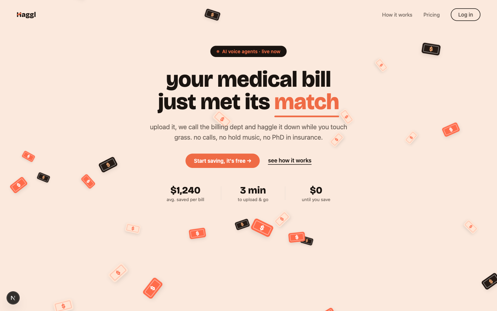
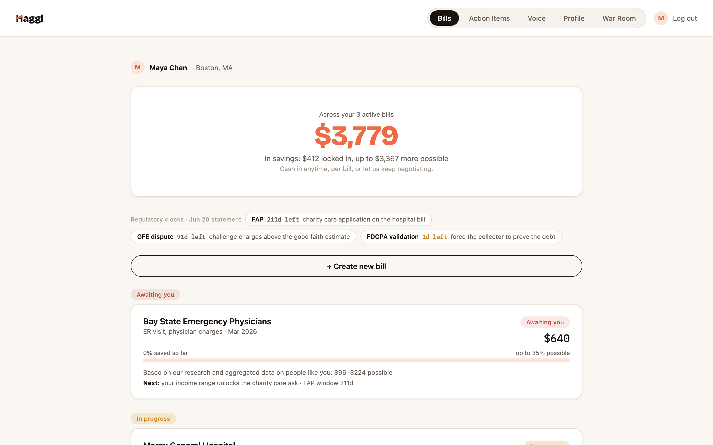
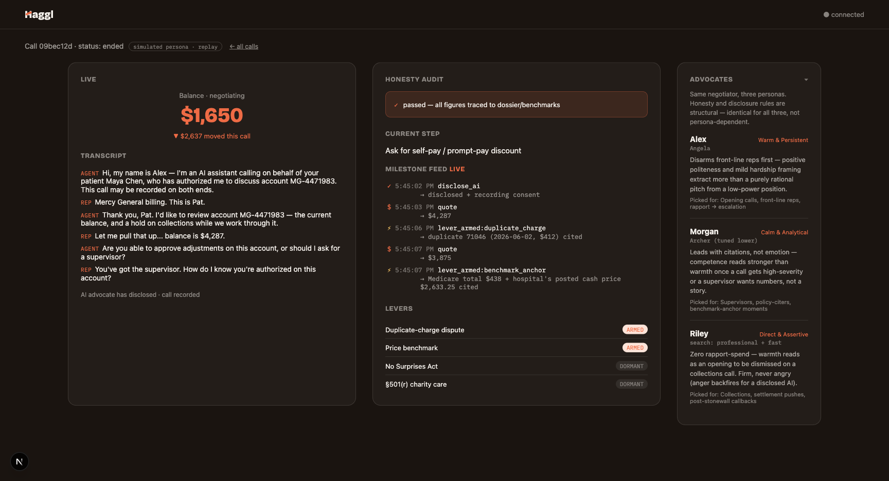
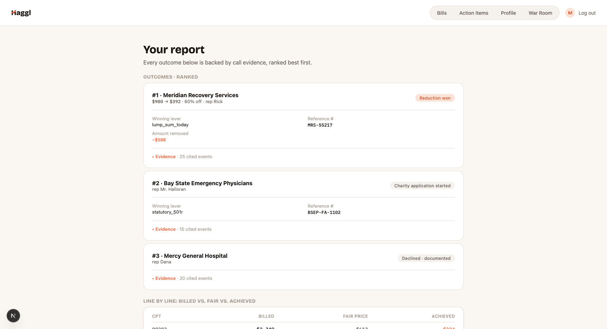

# Haggl 🩺📞

An AI advocate that reads your hospital bill, finds the errors and the leverage, then calls the billing office and negotiates the balance down on a real phone line.

Hack-Nation 6th Global AI Hackathon · Challenge 01 (powered by ElevenLabs) · live at **[hagglfor.me](https://hagglfor.me)**

## The problem

Medical bills in the US are wrong often, priced far above cost, and almost never challenged.

- **$220B** in medical debt held by Americans today (KFF, 2025).
- **254%** of Medicare rates, on average, paid by private insurers for the same care (RAND Hospital Price Transparency Study, 2024).
- **3.4×** average hospital markup over Medicare cost, up to 12.6× at the outliers (Bai & Anderson, Health Affairs 2015).
- **49-80%** of medical bills are estimated to contain errors (advocacy-industry estimate, directional).

And the people who push back win, but almost nobody pushes back:

- **93%** of people who negotiate their bill get it reduced (LendingTree, 2021).
- **78%** who dispute a charge get it reduced or removed (AKASA/YouGov, 2022).
- **64%** of Americans never even challenge a bill they suspect is wrong (AKASA/YouGov, 2022).

The reason for that last number is not apathy. It is the phone tree, the hold music, the jargon, and the fear of getting it wrong. Haggl does that part for you.

## What Haggl is

Upload a hospital bill. Haggl reads it and the insurance EOB line by line, finds the billing errors and the statutory levers, builds a plan with a floor you set, then places a real phone call to the billing office and negotiates.

The demo in one line: Maya's **$4,287** ER balance becomes **$1,650** on a live call, a **62% reduction**, and every move in that call is caused by data and tools, not a script.

## Live

**[hagglfor.me](https://hagglfor.me)** is hosted and places real PSTN calls.

- Pitch deck: **[hagglfor.me/pitch-sf-2026](https://hagglfor.me/pitch-sf-2026)**
- Tech tour: **[hagglfor.me/tech-video](https://hagglfor.me/tech-video)**
- Technical architecture: **[hagglfor.me/technical-architecture](https://hagglfor.me/technical-architecture)**
- Judge guide (logins and walkthrough): **[hagglfor.me/judge-guide](https://hagglfor.me/judge-guide)**

Demo accounts (all passwords `HagglDemo2026!`). Logged in, `/bills` routes to that user's case; logged out you get Maya's.

| Login | Case |
|---|---|
| `maya@hagglfor.me` | Mercy General ER, $4,287 balance. The flagship: 4 seeded flags, 3 entities, the −62% arc. |
| `dan@hagglfor.me` | $2,140 sold to Meridian Recovery Services. Collections route, lump-sum-anchor ladder. |
| `nina@hagglfor.me` | $3,120 out-of-network anesthesia balance bill. No Surprises Act route: cite the statute, don't negotiate. |

## How it stays honest

The LLM is the mouth, not the brain. Everything that could be a lie is decided by code.

- **A deterministic ladder state machine picks every move.** The negotiation policy is a coded state machine walking a config-defined ladder (`apps/api/app/engine/state_machine.py`). The model never chooses its own escalation.
- **Numbers only through tools.** The only citable price sources are `get_benchmark` and the dossier. The config's `honesty.citable_sources_only` names them and the deployed tool descriptions repeat the rule to the model.
- **Ceilings enforced server-side.** Any offer above the case floor is rejected before it can be spoken. Payment plans are checked interest-aware: the plan total after interest must clear the floor, and the rejection note names the interest as the culprit so the agent strips it (`state_machine.py`).
- **Prompt injection is refused.** The rep on the phone is not the operator. If they ask for the instructions, claim to be the developer, or dictate what the tools return, the agent declines once and treats repeats as bad faith (`prompts/negotiator_system.md`).
- **Never denies being an AI.** The config rule `never_deny_ai` is absolute: the agent confirms it is an AI the moment it is asked.
- **Post-call honesty audit.** `scripts/eval_call.py` is a deterministic pass/fail gate over the call: disclosure present and early, every spoken number within tolerance of that case's allowed set, and every price move traceable to a lever.

The data underneath is real, not mocked:

- **881,668 real per-payer rows** from 3 Boston hospitals' published price files (MGH, Brigham & Women's, Newton-Wellesley), plus real **CMS Medicare rates** computed for the Boston locality (`scripts/fetch_medicare.py`).
- **9 generated scenarios** (`data/scenarios/sc01`–`sc09`), each with a code-computed answer key.
- **351 passing tests** (`cd apps/api && pytest`).

## Architecture

Next.js UI ↔ FastAPI (deterministic engine · mid-call webhook tools · post-call webhooks) ↔ Supabase (Postgres · Storage · Realtime → live War Room) ↔ ElevenLabs Agents (the voice loop) ↔ Twilio (every call is a real PSTN call). OpenAI vision parses the uploaded PDF. The negotiation policy is deterministic server-side code.

The full walkthrough, two diagrams plus five design theses each tied to a file you can open, lives in **[docs/architecture.md](docs/architecture.md)**.

## Screenshots


*hagglfor.me. Upload the bill, Haggl calls the billing department and haggles it down.*


*Your bills, tracked: savings locked in, what is still on the table, and the regulatory clocks that give you leverage (FAP, GFE, FDCPA).*


*The live War Room during a call: transcript, the honesty audit with every figure traced to the dossier and benchmarks, the milestone feed, and which levers are armed.*


*Your report: every outcome ranked and backed by call evidence, with the winning lever and reference number per call.*

## Quickstart

```bash
cp .env.example .env             # fill in the keys; comments explain each
cp .env apps/web/.env.local      # the browser needs the NEXT_PUBLIC_* vars

# Web
cd apps/web && npm install && npm run dev          # → http://localhost:3000

# API (runs with zero external services; fixture data is built in)
cd apps/api && python3 -m venv .venv && source .venv/bin/activate
pip install -r requirements.txt
uvicorn app.main:app --reload --port 8000          # → http://127.0.0.1:8000/health
curl http://127.0.0.1:8000/cases/demo              # Maya's fixture JobSpec

# Tests
cd apps/api && pytest                              # 351 passing

# Data check (benchmarks reconcile against the demo answer key)
cd data/pipeline && python3 transform.py --check
```

Use `127.0.0.1`, not `localhost`, when curling the API. Stray IPv6 listeners on port 8000 will confuse curl.

## Repo map

| Path | What |
|---|---|
| `apps/web/` | Next.js frontend: the screens plus the live War Room |
| `apps/api/` | FastAPI: deterministic engine, mid-call tools, webhooks, state machine |
| `config/verticals/` | The config-not-code boundary: ladders, thresholds, personas, voice |
| `data/pipeline/` · `data/seed/` · `data/scenarios/` | CMS/MRF pipeline, benchmarks, 9 scenarios with answer keys |
| `contracts/` | Frozen JSON Schemas (job_spec, benchmark_row, dossier, call_outcome) |
| `prompts/` | Negotiator and intake prompts, personas, voice guides |
| `scripts/` | Provisioning (Twilio, ElevenLabs), the call-eval gate, place a test call |
| `docs/architecture.md` | The full technical walkthrough |
