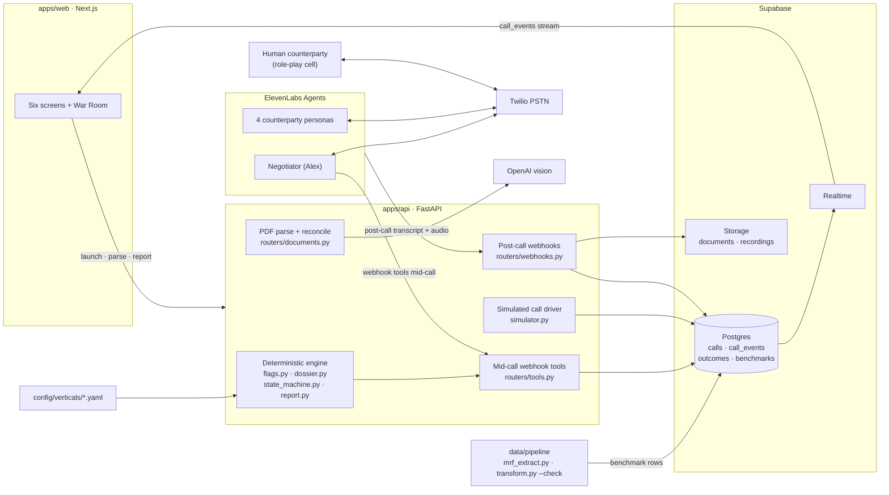
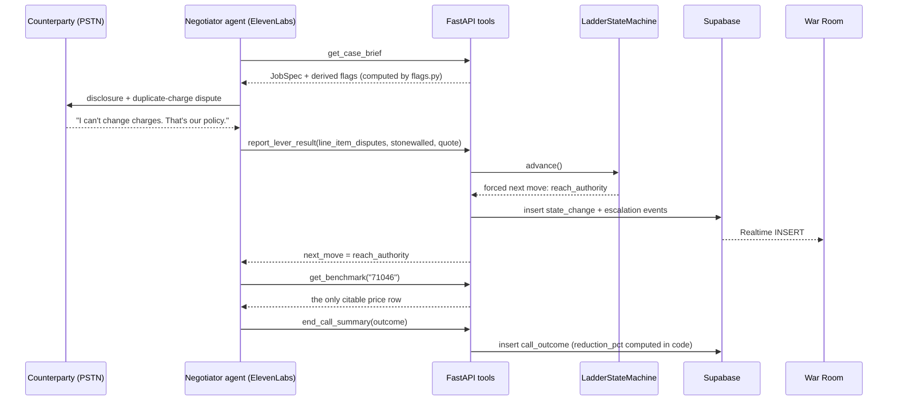

# Architecture

Haggl reads a hospital bill and its EOB, finds the billing errors and the statutory levers, then places real phone calls and negotiates the balance down. This doc explains how the system is built through five claims. Each claim is grounded in a file you can open; paths are relative to the repo root and linked.

The demo case in numbers: Maya's $4,287 ER balance, 4 seeded billing errors, Medicare total $438, the hospital's own posted cash price $2,633.25, settlement at $1,650. Every one of those figures is computed by code in this repo, and this doc shows where.

## The system at a glance

The seams between these boxes are frozen JSON Schemas in [`contracts/`](../contracts): `job_spec` (the confirmed case file), `benchmark_row` (one priced CPT), `strategy_dossier` (route, levers, anchor/target/floor), and `call_outcome` (how every call must end). Each team member built against the schemas, and the pieces met in the middle.

## The mid-call loop

One exchange on a live call looks like this. The voice agent talks; the server decides.

## 1 · The LLM is the mouth, not the brain-stem

Negotiation policy is a coded state machine walking a config-defined ladder. The LLM never chooses its own escalation, and it never computes a number it speaks.

The ladder lives in [`config/verticals/medical_bills.yaml`](../config/verticals/medical_bills.yaml): nine rungs for the provider route (`open_and_hold_account` through `escalate_or_exit`), five for collections. [`apps/api/app/engine/state_machine.py`](../apps/api/app/engine/state_machine.py) walks it. Mid-call, the agent calls `report_lever_result` ([`apps/api/app/routers/tools.py`](../apps/api/app/routers/tools.py)) to report what just happened; the state machine answers with the required next move. The rules enforced in code, not in the prompt:

- A stonewall (reported result, or a config trigger phrase like "that's our policy" detected in the counterparty's quoted words) forces the `reach_authority` rung.
- A hang-up is terminal: `documented_decline`, with a callback as the next action.
- Any offer above the dossier floor is rejected before it can be spoken.
- Settling above the dossier target attaches `escalation_required`, which surfaces as a human-confirmation event in the War Room.

The numbers the agent negotiates with come from [`apps/api/app/engine/dossier.py`](../apps/api/app/engine/dossier.py), which is arithmetic over the JobSpec, the benchmarks table, and config multiples. For the demo case: anchor = 1.5 × the $438 Medicare total = $657; target = min(the $2,633.25 MRF cash total, 2.0 × Medicare) = $876; floor = the $1,700 the patient can actually pay. The simulated supervisor call settles at $1,650: under the floor, so allowed, but above the target, so the engine emits the escalation event you see in the War Room.

The upstream analysis is deterministic too. [`apps/api/app/engine/flags.py`](../apps/api/app/engine/flags.py) detects all five red-flag types (duplicate, upcode, unbundle, EOB mismatch, markup) from config thresholds and the NCCI pair table, with a documented dollar-impact convention per type and a rule that markup skips lines already explained by another flag, so the same dollars are never claimed twice. [`apps/api/app/engine/report.py`](../apps/api/app/engine/report.py) ranks outcomes and assembles the recommendation string from data. No LLM call appears anywhere in `apps/api/app/engine/`.

## 2 · Honesty is structural

The agent cannot bluff, because the numbers it may speak are tool-gated. `get_benchmark` and the dossier are the only citable price sources: the config's `honesty.citable_sources_only` names them, the deployed tool descriptions repeat the rule to the model, and the eval gate checks every spoken number after the call. `reduction_pct` on every outcome is computed by code in `end_call_summary`, never by the model.

We can prove this boundary matters because we watched it fail without it. The first tool-less PSTN call invented a CPT code and a date, which is the exact failure this design exists to prevent. The same day, the four webhook tools (`get_case_brief`, `get_benchmark`, `report_lever_result`, `end_call_summary`) were registered on the live agent, pointing at `api.hagglfor.me` (commit `812c7df`, [`scripts/provision_elevenlabs.py`](../scripts/provision_elevenlabs.py), see `NEGOTIATOR_TOOLS`). The tool descriptions carry the rule to the model: call `get_case_brief` first, never state a code, date, or amount that is not in the brief.

The same live hardening caught a transport bug: the first real agent-to-agent call produced four minutes of mutual silence (empty negotiator first message, persona greeting not firing). The fix has the negotiator open with the compliance disclosure line, which policy wanted first anyway (commit `822d120`, same file).

Honesty is then verified, not asserted. [`scripts/eval_call.py`](../scripts/eval_call.py) is a deterministic pass/fail gate over a call artifact: disclosure present and early, every spoken number within tolerance of the allowed set (benchmarks, dossier, case facts), a structured outcome, and every price move traceable to a lever. On the disclosure itself, the config rule `never_deny_ai: true` is absolute: the agent confirms it is an AI the moment it is asked and never denies it.

## 3 · Verticals are config

Everything specific to medical bills is data in [`config/verticals/medical_bills.yaml`](../config/verticals/medical_bills.yaml): red-flag thresholds, the E/M upcode pairs, the fair-band multiples, the routing thresholds, both negotiation ladders, the stonewall trigger phrases, the persona roster, the voice settings, and the disclosure policy. The engine modules read that file; they hard-code none of it. `flags.py` takes its match keys and minimums from `red_flags`, `state_machine.py` takes its ladder and escalation triggers from `ladder` and `escalation_triggers`, `dossier.py` takes its multiples from `benchmark` and its charity-care gate from `thresholds`.

[`config/verticals/moving.yaml`](../config/verticals/moving.yaml) sits next to it: same schema, a moving-quotes ladder (`describe_job_verbatim` through `close_or_decline`), a lowball flag instead of an upcode flag, different personas. It is a stub by design, and it is the honest size of the claim: retargeting the system is writing that file, plus benchmark data for the new vertical.

## 4 · Real data, gated by reconciliation

The benchmark numbers the agent cites on calls come from a real hospital's published price file. [`data/pipeline/mrf_extract.py`](../data/pipeline/mrf_extract.py) stream-filters Massachusetts General Hospital's CMS v3.0.0 price-transparency CSV (60MB, 159k rows, about a second) down to the demo CPT list, with the cleaning rules stated in the module docstring: commercial-payer-only negotiated medians (the RAND comparison class), professional/technical component rows dropped, negotiated values below 20% or above 20x Medicare dropped as data errors, and a weighted median so a single-claim rate cannot swamp well-evidenced ones. Every drop is counted and printed by `--report`.

The output is gated before anyone integrates it. `python data/pipeline/transform.py --check` asserts the seed against [`data/seed/demo_answer_key.json`](../data/seed/demo_answer_key.json), the single source of truth for every demo number: a benchmark row exists for every demo CPT, the Medicare total is exactly $438.00, the MRF cash total is exactly $2,633.25, every row's band equals Medicare times the config multiples, and the negotiation arc arithmetic holds (4,287 − 412 = 3,875). The check fails closed with a named error per violation ([`data/pipeline/transform.py`](../data/pipeline/transform.py), `check()`).

The demo documents reconcile by construction. [`data/demo_docs/generate_demo_pdfs.py`](../data/demo_docs/generate_demo_pdfs.py) derives the bill and EOB PDFs from the fixture line items and asserts the sums (8,432 / 4,287 / 3,875) before writing a page. So when [`apps/api/app/routers/documents.py`](../apps/api/app/routers/documents.py) runs the uploaded PDF through OpenAI vision, the extraction can be diffed field-by-field against the fixtures (`reconcile_bill`, with an exact/partial/failed verdict), and the real flag engine runs over the parsed lines. The LLM extracts; code decides what is an error.

## 5 · One transport

Every call is a real PSTN call through ElevenLabs Agents' native Twilio integration. The negotiator dials out from our Massachusetts Twilio number; the callee is either a persona agent bound to its own inbound number (the simulated market) or a human's cell (role-play). Same code path both ways: [`scripts/place_test_call.py`](../scripts/place_test_call.py) takes any phone number as its argument, and [`scripts/provision_twilio.py`](../scripts/provision_twilio.py) buys the numbers and binds persona agents to them. There is no separate "demo mode" audio stack to distrust.

The War Room has the same property on the data side. [`apps/api/app/simulator.py`](../apps/api/app/simulator.py) replays full negotiations into Supabase using the identical `call_events` contract the real calls produce (status, transcript, tool_call, quote, state_change, escalation, then a terminal outcome), and its ladder rungs come from the real `LadderStateMachine`, never hand-written indices. The frontend subscribes to `call_events` INSERTs over Supabase Realtime ([`apps/web/lib/realtime.ts`](../apps/web/lib/realtime.ts)) and renders whatever arrives. A simulated call and a live PSTN call are indistinguishable to the UI, which means the UI built against the simulator needs zero changes when the call is real.

## If you only open three files

1. [`apps/api/app/engine/state_machine.py`](../apps/api/app/engine/state_machine.py): the negotiation brain, with the floor/stonewall/hangup rules in code.
2. [`scripts/provision_elevenlabs.py`](../scripts/provision_elevenlabs.py): the honesty boundary as deployed tools, with both live failure fixes annotated in place.
3. [`data/pipeline/transform.py`](../data/pipeline/transform.py): run it with `--check` and watch the demo's numbers reconcile against the answer key.

The rule the whole build follows: anything with a number, a threshold, or a legal claim is computed in code and served to the model through a tool. The model decides how to say it. Code decides what is true.
